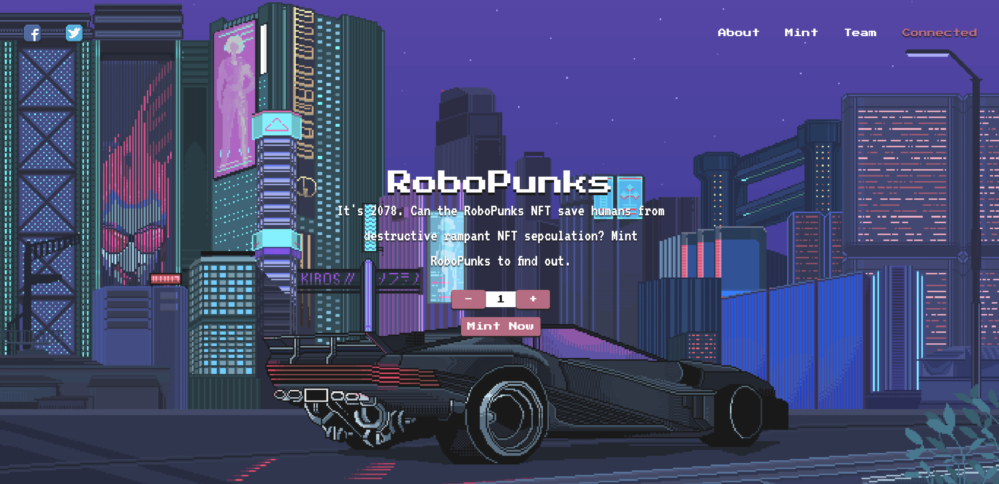
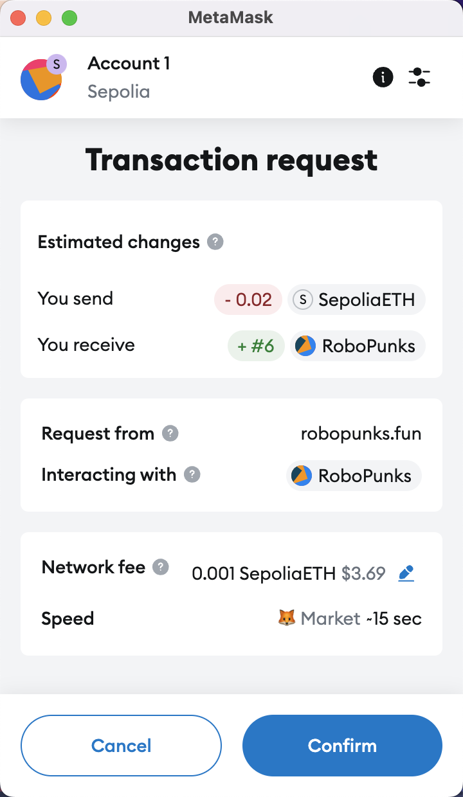
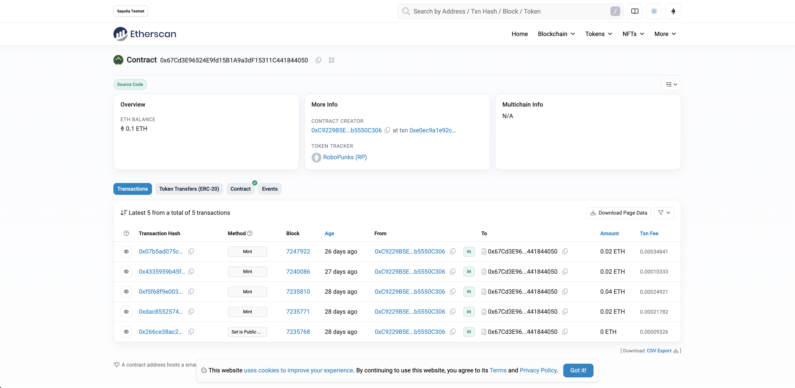

  <h1>
    RoboPunks NFT
  </h1>
  
  

    Mint RoboPunks to find out!
  

  <h4>
    <a href="https://robopunks.fun/">Visit & Mint RoboPunks!</a> | 
    <a href="https://sepolia.etherscan.io/address/0x67Cd3E96524E9fd15B1A9a3dF15311C441844050#code">Etherscan</a>
	</h4>

## 🌟 About the Project

An intuitive NFT minting website developed by Next.js with MetaMask integration. ERC721 based smart contract deployed on Sepolia testnet!

### 👾 Tech Stack

- Next.js
- Ethers
- Solidity
- Hardhat
- Vercel

### 📷 Screenshot

